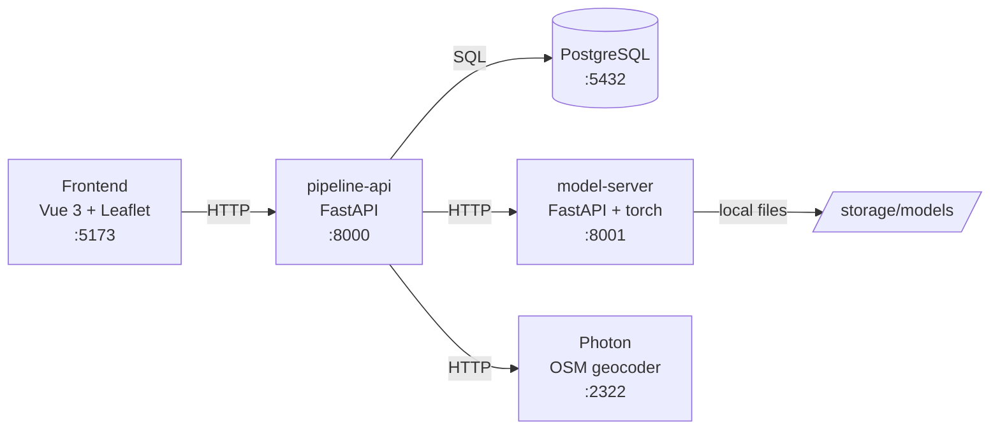

# Crisis Pipeline Lab — Early Fire Detection

A **benchmark lab** for crisis-detection pipelines. Instead of building one wildfire-detection pipeline, this project lets you _compare_ pipelines, models, and paradigms on annotated tweet datasets — with no dependency on a live Twitter API.

The central question it answers: **which pipeline detects crisis signals best, with what precision, and where geographically?**

> Built as a simulator / research tool. Runs fully locally via Docker. No auth — designed for local/dev use.

---

## What it does

Each tweet from a labeled dataset flows through a configurable 4-stage pipeline:

```
relevance_classifier → location_extractor → geocoder → event_matcher
```

- **Relevance classifier** — filters out noise (is this a crisis signal?)
- **Location extractor** — pulls geographic entities (GLiNER, zero-shot NER)
- **Geocoder** — resolves place names to coordinates (self-hosted Photon / OpenStreetMap)
- **Event matcher** — clusters nearby tweets into events (Haversine, configurable radius)

On top of that:

- **Synchronous simulations** with cancellation (live progress streaming lands in v2)
- **Matrix benchmarking** — run `classifiers × location models` in one click, ranked by F1
- **Metrics** — precision / recall / F1 / accuracy, persisted per run
- **Qualitative inspection** — per-tweet traces, hard cases (false negatives), "where did it die?" breakdown
- **Model import** — from HuggingFace Hub (filtered by component type) or by zip upload

---

## Architecture



| Service        | Port | Role                                                  |
| -------------- | ---- | ----------------------------------------------------- |
| `pipeline-api` | 8000 | Main API — business logic, orchestration, DB          |
| `model-server` | 8001 | ML inference (classifier + GLiNER), hot model loading |
| `postgres`     | 5432 | Database                                              |
| `photon`       | 2322 | Self-hosted OSM geocoder (regional OSM dump)          |
| `frontend`     | 5173 | Vue 3 UI                                              |

**Backend layering** (enforced): thin routes → services (business logic) → repositories (all SQL). Pipeline stages are pluggable components behind a typed contract.

---

## Stack

- **Backend** — Python, FastAPI, PostgreSQL, psycopg2
- **ML** — PyTorch, Transformers, GLiNER, scikit-learn (roadmap)
- **Frontend** — Vue 3 (Composition API), TypeScript, Pinia, Leaflet
- **Geocoding** — Photon (OpenStreetMap)
- **Infra** — Docker Compose

---

## Quickstart

**Prerequisites:** Docker + Docker Compose v2. Nothing else — model download runs
inside a throwaway container, so no host Python/Java/zstd is required.

```bash
# 1. Clone
git clone https://github.com/MathiasDsy/crisis-pipeline-lab.git
cd crisis-pipeline-lab/early_fire_detection
```

```bash
# 2a. Backend dev stack — postgres + model-server + pipeline-api only
docker compose up -d --build

# 2b. Full stack — everything, including the frontend and Photon geocoder
GEOCODING_ENABLED=true docker compose --profile full up -d --build
```

The stack is split with Compose **profiles**: the default `docker compose up`
brings up only the three backend services (fast, no Photon) for API work and
tests. The `full` profile adds the **frontend** (open **http://localhost:5173**)
and **Photon**. Services wait on each other's **healthchecks** — `pipeline-api`
starts only once postgres and model-server are actually healthy, not merely
started.

Each service provisions itself on **first boot** — no separate setup script:

| Service          | What it does on first boot                                                                                                                                                                                                    |
| ---------------- | ----------------------------------------------------------------------------------------------------------------------------------------------------------------------------------------------------------------------------- |
| **model-server** | downloads `relevance_model` + `gliner_multi-v2.1` from HuggingFace into `backend/storage/models/` via its entrypoint (see [`backend/model_api/scripts/models_manifest.json`](backend/model_api/scripts/models_manifest.json)) |
| **photon**       | downloads the regional Photon dump (`.jsonl.zst`, hosted by GraphHopper) and imports it into `services/photon/data/photon_data/` via its entrypoint — a one-time step of a few minutes                                        |
| **pipeline-api** | on startup, auto-discovers datasets, models, and pipelines from `backend/storage/`                                                                                                                                            |

Both provisioning steps are **idempotent**: models and the Photon index that are
already present are skipped, so restarts don't re-download anything. First boot is
slow (downloads + Photon import); the model-server is unavailable until its models
are pulled.

Optional configuration:

- `GEOCODING_ENABLED` — toggles the geocoder stage. Defaults to `true` in code but
  `false` in the dev stack (Photon isn't started there), so the geocoder is skipped
  cleanly (`blocked`, not `error`) instead of failing on an unreachable Photon. Set
  `GEOCODING_ENABLED=true` with `--profile full` to geocode against Photon.
- `HF_TOKEN` — export it before `docker compose up` only if one of the model repos
  is private (it's passed through to the model-server).
- The Photon region is set in [`services/photon/entrypoint.sh`](services/photon/entrypoint.sh)
  (default: **Croatia**). Photon holds one region at a time (RAM-bound); pick the one
  that covers your datasets.

> Everything runs in throwaway containers — no host Java, Python, or zstd needed.
> Docker is the only requirement.

> Models are **not** in git (`backend/storage/` is gitignored). They are pulled from
> the Hub on first boot — no git LFS, light clone. See [Publishing the models](#publishing-the-models-maintainer).

### Publishing the models (maintainer)

The model-server downloads from HuggingFace on first boot. GLiNER is public; the
relevance classifier is your fine-tuned model — push it to the Hub **once**:

```bash
pip install huggingface_hub
huggingface-cli login
# push the whole folder (weights + config + tokenizer)
huggingface-cli upload MathiasDsy/relevance_classifier_v1 \
  backend/storage/models/relevance_model .
```

The `repo_id` must match the one in [`backend/model_api/scripts/models_manifest.json`](backend/model_api/scripts/models_manifest.json).
The `metadata.json` required by discovery is rewritten from that manifest — no need
to include it in the HF repo.

### Adding data & models

```bash
# Label the CrisisLexT26 CSVs (adds a boolean `label` column)
cd backend && python label_datasets.py

# Datasets / models / pipelines are re-scanned at startup, or trigger manually:
curl -X POST http://localhost:8000/datasets/discover
curl -X POST http://localhost:8000/models/discover
```

Import a classifier from HuggingFace (type enforced by the component contract):

```bash
curl -X POST http://localhost:8000/models/import/huggingface \
  -H "Content-Type: application/json" \
  -d '{"repo_id": "cardiffnlp/twitter-roberta-base-sentiment",
       "model_key": "sentiment_v1",
       "component": "relevance_classifier"}'
```

---

## Running a simulation

```bash
# Runs synchronously: loads the models, executes the whole dataset, then returns
# the finished run with its status. Live progress streaming is deferred to v2.
curl -X POST http://localhost:8000/simulation/start \
  -H "Content-Type: application/json" \
  -d '{"dataset_id": "<uuid>", "pipeline_config_id": "<uuid>"}'

# Cancel an in-flight run (resolve its id via /runs?status=running)
curl -X POST http://localhost:8000/simulation/<run_id>/cancel

# Metrics
curl http://localhost:8000/simulation/<run_id>/metrics
```

### Benchmarking a matrix

```bash
curl -X POST http://localhost:8000/benchmarks/start \
  -H "Content-Type: application/json" \
  -d '{"dataset_id": "<uuid>",
       "classifier_model_keys": ["clf_a", "clf_b"],
       "location_model_keys": ["gliner_multi"],
       "name": "wildfire bench"}'

# Leaderboard, ranked by F1
curl http://localhost:8000/benchmarks/<id>/leaderboard
```

The full API reference lives in [`frontend/CLAUDE_API_ROUTES.md`](frontend/CLAUDE_API_ROUTES.md).

---

## Pipeline configuration

Pipelines are declared in YAML (dropped in `backend/storage/pipelines/` or uploaded):

```yaml
name: Fire Detection V1
version: "1.0.0"
runtime:
  stop_on_error: true
steps:
  - id: relevance
    component_key: relevance_classifier
    model_key: relevance_xlmroberta_finetuned_v1
    input: { text: tweet.content }
    output: outputs.relevance
    params: { threshold: 0.7 }
  - id: location
    component_key: location_extractor
    model_key: gliner_multi_v2_1
    input: { text: tweet.content }
    output: outputs.locations
    params: { threshold: 0.5 }
  - id: geocoding
    component_key: geocoder
    input: { locations: outputs.locations }
    output: outputs.geocoding
  - id: event_matching
    component_key: event_matcher
    input: { geocoding: outputs.geocoding }
    output: outputs.event
    params: { radius_km: 5.0 }
```

---

## Datasets

Built around **CrisisLexT26** — 26 annotated crisis events (wildfires, floods, earthquakes, etc.). Expected CSV columns:

- `content` (required) — tweet text
- `label` (required) — `True`/`False` (crisis-relevant or not)

---

## Project structure

```
early_fire_detection/
├── backend/
│   ├── app_api/          # pipeline-api (FastAPI)
│   │   └── src/
│   │       ├── routes/         # thin HTTP layer
│   │       ├── services/       # business logic
│   │       ├── repositories/   # all SQL
│   │       ├── components/     # pluggable pipeline stages
│   │       └── pipeline/       # the runner
│   ├── model_api/        # model-server (inference)
│   └── storage/          # datasets, models, pipelines (gitignored)
├── frontend/             # Vue 3 app + API docs
├── services/
│   ├── photon/           # geocoder dump
│   └── postgres/init/    # schema
└── docker-compose.yml
```

---

## Honest limitations (V1)

This is a lab, and it's explicit about what it can and can't measure:

- **Only stage 1 (relevance) has ground truth.** Location/geocoding/event scoring is qualitative — you inspect, you don't score. Scoring those needs per-tweet gold annotations (schema exists, population doesn't yet).
- **The end-to-end pass/block metric conflates** classifier error with "no location found" and "geocoder failed". Direct per-stage classifier scoring is on the roadmap.
- **Geocoder is region-scoped.** Photon holds one OSM dump at a time (RAM-bound). Tweets outside the loaded region geocode poorly.
- **Simulations run sequentially.** The model-server holds one model set in memory; concurrent runs are refused (409) to protect metric integrity.
- **No authentication.** Local/dev use only.

See `frontend/CLAUDE_PROJECT_V1.md` for the full design notes and V2 roadmap (in-app training, scikit-learn classifier sandbox, per-stage scoring, multi-region Photon).

---

## Roadmap (V2)

- **Per-stage scoring** — measure the classifier step directly against the label (not end-to-end pass/block)
- **In-app training** — fine-tune classifiers on labeled data; scikit-learn family first (CPU-cheap, self-contained)
- **Configurable components** — zero-shot classifiers with candidate labels, typed params per component
- **Multi-region geocoding** — per-region Photon instances routed by dataset
- **Result comparison** — stable per-sample identity for cross-model pivot views & aggregated hard cases

---

## License

MIT
