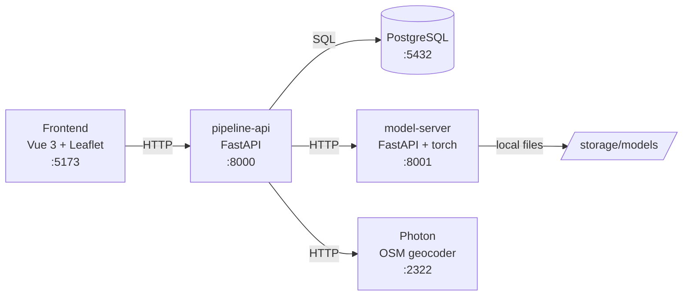

# Crisis Pipeline Lab — Early Fire Detection

A **benchmark lab** for crisis-detection pipelines. Instead of building one wildfire-detection pipeline, this project lets you *compare* pipelines, models, and paradigms on annotated tweet datasets — with no dependency on a live Twitter API.

The central question it answers: **which pipeline detects crisis signals best, with what precision, and where geographically?**

> Built as a simulator / research tool. Runs fully locally via Docker. No auth — designed for local/dev use.

---

## What it does

Each tweet from a labeled dataset flows through a configurable 4-stage pipeline:

```
relevance_classifier → location_extractor → geocoder → event_matcher
```

- **Relevance classifier** — filters out noise (is this a crisis signal?)
- **Location extractor** — pulls geographic entities (GLiNER, zero-shot NER)
- **Geocoder** — resolves place names to coordinates (self-hosted Photon / OpenStreetMap)
- **Event matcher** — clusters nearby tweets into events (Haversine, configurable radius)

On top of that:

- **Async simulations** with live status polling and cancellation
- **Matrix benchmarking** — run `classifiers × location models` in one click, ranked by F1
- **Metrics** — precision / recall / F1 / accuracy, persisted per run
- **Qualitative inspection** — per-tweet traces, hard cases (false negatives), "where did it die?" breakdown
- **Model import** — from HuggingFace Hub (filtered by component type) or by zip upload

---

## Architecture



| Service | Port | Role |
|---------|------|------|
| `pipeline-api` | 8000 | Main API — business logic, orchestration, DB |
| `model-server` | 8001 | ML inference (classifier + GLiNER), hot model loading |
| `postgres` | 5432 | Database |
| `photon` | 2322 | Self-hosted OSM geocoder (regional OSM dump) |
| `frontend` | 5173 | Vue 3 UI |

**Backend layering** (enforced): thin routes → services (business logic) → repositories (all SQL). Pipeline stages are pluggable components behind a typed contract.

---

## Stack

- **Backend** — Python, FastAPI, PostgreSQL, psycopg2
- **ML** — PyTorch, Transformers, GLiNER, scikit-learn (roadmap)
- **Frontend** — Vue 3 (Composition API), TypeScript, Pinia, Leaflet
- **Geocoding** — Photon (OpenStreetMap)
- **Infra** — Docker Compose

---

## Quickstart

**Prérequis :** Docker + Docker Compose v2. Rien d'autre (le download des modèles
tourne dans un conteneur jetable — pas besoin de Python côté hôte).

```bash
# 1. Clone
git clone https://github.com/MathiasDsy/crisis-pipeline-lab.git
cd crisis-pipeline-lab/early_fire_detection

# 2. Une seule commande : download des modèles + géocodeur + toute la stack
./init.sh
```

Puis ouvre **http://localhost:5173**.

Ce que fait `init.sh` :

| Étape | Détail |
|---|---|
| **Modèles** | télécharge `relevance_model` + `gliner_multi-v2.1` depuis HuggingFace vers `backend/storage/models/` (voir [`scripts/models_manifest.json`](scripts/models_manifest.json)) |
| **Géocodeur** | télécharge le dump Photon régional (`.jsonl.zst`, hébergé par GraphHopper), l'importe dans `services/photon/data/photon_data/` — étape unique de quelques minutes |
| **Stack** | `docker compose up -d --build` — api, model-server, photon, postgres, frontend |

Le script est **idempotent** : modèles et index Photon déjà présents sont ignorés,
tu peux relancer `./init.sh` sans rien re-télécharger. Variables optionnelles :

- `PHOTON_DUMP_URL` — pour changer de région/version. Défaut : dump **Croatie**
  (`photon-dump-croatia-1.0-latest.jsonl.zst`). Photon ne charge qu'une région à la
  fois (RAM-bound) ; choisis celle qui couvre tes datasets.
- `HF_TOKEN` — seulement si l'un des repos modèles est privé.

> Tout tourne dans des conteneurs jetables — pas besoin de Java, Python ni zstd
> côté hôte. Seul Docker est requis.

> Les modèles ne sont **pas** dans git (`backend/storage/` est gitignoré). Ils sont
> tirés du Hub au setup — pas de git LFS, clone léger. Voir [Publier les modèles](#publier-les-modèles-mainteneur).

On startup, `pipeline-api` auto-discovers datasets, models, and pipelines from `backend/storage/`.

### Publier les modèles (mainteneur)

`init.sh` télécharge depuis HuggingFace. GLiNER est public ; le classifier de
pertinence est ton modèle fine-tuné — pousse-le **une fois** sur le Hub :

```bash
pip install huggingface_hub
huggingface-cli login
# pousse tout le dossier (poids + config + tokenizer)
huggingface-cli upload MathiasDsy/relevance_classifier_v1 \
  backend/storage/models/relevance_model .
```

Le `repo_id` doit correspondre à celui de [`scripts/models_manifest.json`](scripts/models_manifest.json).
Le `metadata.json` requis par le discovery est réécrit depuis ce manifest — pas
besoin de l'inclure dans le repo HF.

### Adding data & models

```bash
# Label the CrisisLexT26 CSVs (adds a boolean `label` column)
cd backend && python label_datasets.py

# Datasets / models / pipelines are re-scanned at startup, or trigger manually:
curl -X POST http://localhost:8000/datasets/discover
curl -X POST http://localhost:8000/models/discover
```

Import a classifier from HuggingFace (type enforced by the component contract):

```bash
curl -X POST http://localhost:8000/models/import/huggingface \
  -H "Content-Type: application/json" \
  -d '{"repo_id": "cardiffnlp/twitter-roberta-base-sentiment",
       "model_key": "sentiment_v1",
       "component": "relevance_classifier"}'
```

---

## Running a simulation

```bash
# Starts asynchronously, returns a run_id immediately
curl -X POST http://localhost:8000/simulation/start \
  -H "Content-Type: application/json" \
  -d '{"dataset_id": "<uuid>", "pipeline_config_id": "<uuid>"}'

# Poll status until it's no longer "running"
curl http://localhost:8000/simulation/<run_id>

# Metrics
curl http://localhost:8000/simulation/<run_id>/metrics
```

### Benchmarking a matrix

```bash
curl -X POST http://localhost:8000/benchmarks/start \
  -H "Content-Type: application/json" \
  -d '{"dataset_id": "<uuid>",
       "classifier_model_keys": ["clf_a", "clf_b"],
       "location_model_keys": ["gliner_multi"],
       "name": "wildfire bench"}'

# Leaderboard, ranked by F1
curl http://localhost:8000/benchmarks/<id>/leaderboard
```

The full API reference lives in [`frontend/CLAUDE_API_ROUTES.md`](frontend/CLAUDE_API_ROUTES.md).

---

## Pipeline configuration

Pipelines are declared in YAML (dropped in `backend/storage/pipelines/` or uploaded):

```yaml
name: Fire Detection V1
version: "1.0.0"
runtime:
  stop_on_error: true
steps:
  - id: relevance
    component_key: relevance_classifier
    model_key: relevance_xlmroberta_finetuned_v1
    input: { text: tweet.content }
    output: outputs.relevance
    params: { threshold: 0.7 }
  - id: location
    component_key: location_extractor
    model_key: gliner_multi_v2_1
    input: { text: tweet.content }
    output: outputs.locations
    params: { threshold: 0.5 }
  - id: geocoding
    component_key: geocoder
    input: { locations: outputs.locations }
    output: outputs.geocoding
  - id: event_matching
    component_key: event_matcher
    input: { geocoding: outputs.geocoding }
    output: outputs.event
    params: { radius_km: 5.0 }
```

---

## Datasets

Built around **CrisisLexT26** — 26 annotated crisis events (wildfires, floods, earthquakes, etc.). Expected CSV columns:

- `content` (required) — tweet text
- `label` (required) — `True`/`False` (crisis-relevant or not)

---

## Project structure

```
early_fire_detection/
├── backend/
│   ├── app_api/          # pipeline-api (FastAPI)
│   │   └── src/
│   │       ├── routes/         # thin HTTP layer
│   │       ├── services/       # business logic
│   │       ├── repositories/   # all SQL
│   │       ├── components/     # pluggable pipeline stages
│   │       └── pipeline/       # the runner
│   ├── model_api/        # model-server (inference)
│   └── storage/          # datasets, models, pipelines (gitignored)
├── frontend/             # Vue 3 app + API docs
├── services/
│   ├── photon/           # geocoder dump
│   └── postgres/init/    # schema
└── docker-compose.yml
```

---

## Honest limitations (V1)

This is a lab, and it's explicit about what it can and can't measure:

- **Only stage 1 (relevance) has ground truth.** Location/geocoding/event scoring is qualitative — you inspect, you don't score. Scoring those needs per-tweet gold annotations (schema exists, population doesn't yet).
- **The end-to-end pass/block metric conflates** classifier error with "no location found" and "geocoder failed". Direct per-stage classifier scoring is on the roadmap.
- **Geocoder is region-scoped.** Photon holds one OSM dump at a time (RAM-bound). Tweets outside the loaded region geocode poorly.
- **Simulations run sequentially.** The model-server holds one model set in memory; concurrent runs are refused (409) to protect metric integrity.
- **No authentication.** Local/dev use only.

See `frontend/CLAUDE_PROJECT_V1.md` for the full design notes and V2 roadmap (in-app training, scikit-learn classifier sandbox, per-stage scoring, multi-region Photon).

---

## Roadmap (V2)

- **Per-stage scoring** — measure the classifier step directly against the label (not end-to-end pass/block)
- **In-app training** — fine-tune classifiers on labeled data; scikit-learn family first (CPU-cheap, self-contained)
- **Configurable components** — zero-shot classifiers with candidate labels, typed params per component
- **Multi-region geocoding** — per-region Photon instances routed by dataset
- **Result comparison** — stable per-sample identity for cross-model pivot views & aggregated hard cases

---

## License

TBD.
